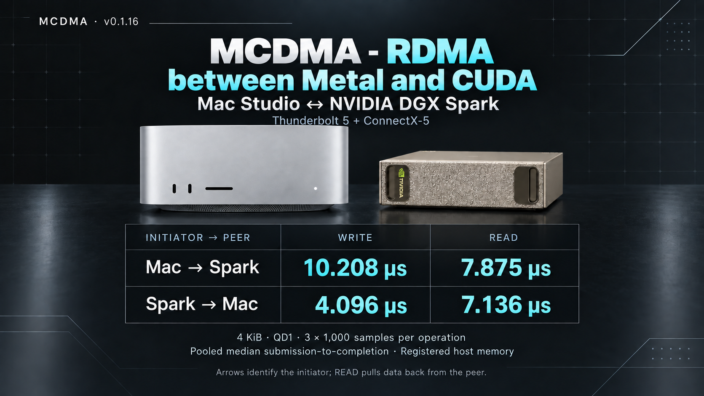

# MCDMA



*Measured host-memory RDMA with the Studio GPU active; shared Metal/CUDA buffer correctness was verified separately.*

## What changed in 0.1.18

**0.1.18 is the current development release**, with larger memory registrations, safer context cleanup, additional verbs support, lifecycle tests and bandwidth tooling. The 17 September update also restricts runtime setting changes to root and adds PCIe counter diagnostics. Hardware checks now include 12 process terminations during sustained traffic, concurrent transfers on both Spark links and measured sustained bandwidth; see the [validation and bandwidth report](docs/validation-2026-09-17.md).

**CLI 1.1.0** prevents driver downgrades, checks package integrity, invalidates stale test results and verifies the requested posting mode; latency runs retain raw samples, and `mcdma bandwidth` runs the new throughput tool. See [all 0.1.18 changes and remaining checks](docs/release-0.1.18.md) and the [CLI guide](cli/README.md).

A speedup over 0.1.17 has **not** been measured in a matched comparison, and the original unattributed panic is not proven fixed. The latency table below remains the historical 0.1.17 result.

## Speed: one Spark ↔ one Mac Studio

**Link: 100 Gb/s, validated 2026-09-15.** The Mac–Spark link now uses **Mellanox MCP1600-C001E30N** passive copper QSFP28 cables and negotiates **100GBASE-CR4 with RS-FEC**. Seven runs at 100 Gb/s each passed four-way byte verification; their 4 KiB medians were **0.1–0.4 µs lower** than the 40 Gb/s runs recorded the same morning, and they are listed with their conditions in the [measurement note](docs/gpu-keepalive.md#100-gbs-link-runs). The headline table below is still the earlier pooled 40 Gb/s result, because it has 3 × 1,000 samples per operation; each 100 Gb/s run has 1,000. The port rate is not the throughput ceiling: the driver's PCIe-path readout shows the Thunderbolt 5 tunnel as **PCIe Gen4 x4 with a 128-byte maximum payload on every hop**, and that tunnel, not the 100 Gb/s port, bounds end-to-end throughput. Sustained tests on 0.1.18 now measure about **50.6 Gbit/s into Studio memory and 29.4 Gbit/s out** with Studio-initiated READ and WRITE; the [report](docs/validation-2026-09-17.md) gives the build identities, transfer sizes, durations and verification limits.

| Initiator → peer | RDMA WRITE | RDMA READ |
|---|---:|---:|
| Mac Studio → Spark | **7.625 µs** | **6.042 µs** |
| Spark → Mac Studio | **3.680 µs** | **5.536 µs** |

Measured on **macOS 27, build 26A428**, with an **M3 Ultra Mac Studio, 256 GB**, and **one NVIDIA DGX Spark**, using lab driver **0.1.17**, userspace BlueFlame-64 and **continuous Metal keepalive on the Studio**. These are 4 KiB submission-to-application-observed-completion medians at queue depth one and **RDMA path MTU 1024**, recorded over the 40 Gb/s link negotiated by the earlier cable and pooled across three runs with 1,000 samples per operation per initiator after 100 warmups. All 12,000 measured samples are retained, including outliers.

The arrow names the initiator: a Mac-initiated READ fetches bytes from the Spark. These are registered host-memory measurements, not one-way network latency, GPU-buffer latency or inference results. WRITE / READ p95 values were **14.000 / 10.708 µs** from the Mac and **4.320 / 6.304 µs** from the Spark. The [measurement note](docs/gpu-keepalive.md) includes tails, per-run results and reproduction steps; raw traces remain outside this driver repository.

**What changed:** keeping the Studio GPU active with a small Metal workload repeatedly reduced RDMA latency in our tests. Our working explanation is a platform power/performance state associated with GPU activity; the exact internal mechanism is not measured. `fabric-keepalive` is an optional, unprivileged userspace program with no reboot or driver setting required. It consumes GPU time and power, so test its effect on your actual workload.

**Version distinction:** the measurements above used lab driver 0.1.17; this repository now builds **0.1.18**. The new driver has correctness, bounded lifecycle and sustained-bandwidth results, but no matched 0.1.17 versus 0.1.18 performance comparison.

MCDMA is an experimental native macOS RDMA driver and userspace verbs provider for Mellanox ConnectX-5 Ex, developed by **Ash Hart**. The NICs move the payload; the CPU still submits work and observes completions.

## Integration with inference engines

MCDMA provides the RDMA driver and verbs transport. Using that transport for inference requires further integration in engines and frameworks such as **oMLX, MLX-LM and llama.cpp**, through their memory allocators and communication backends. The runtime needs to allocate transferred tensors in GPU-accessible memory that can also be registered for RDMA, retain those allocations and registrations until transfers finish, and synchronize GPU execution with transfer completion.

Separate functional tests have verified RDMA WRITE and READ in both initiation directions using Metal shared buffers and CUDA mapped host allocations. GPU kernels produced and checked the payload in the same allocations registered with RDMA, without a payload staging copy. These tests establish GPU access to the transferred memory; the latency table above measures ordinary host buffers and is not an inference or GPU-buffer benchmark. The CPU still schedules GPU work and manages RDMA operations.

Installing MCDMA alone does not connect an inference engine to this path. Direct registration of an existing `cudaMalloc` allocation still fails on the tested Spark, and direct access to Metal private buffers remains unverified; the verified approach is to create the transferred tensors in compatible shared allocations from the outset.

**I plan to submit a pull request to oMLX to integrate MCDMA**, starting with the allocation and transfer support needed for this shared GPU-accessible memory path. That integration is planned and has not yet been implemented or submitted.

A first end-to-end hand-off has run: **Qwen3-4B in MXFP4** was prefilled by vLLM on the Spark, its KV cache was pulled over RDMA, and the reply was decoded by MLX on the Studio. The split reply was the fastest of the three arrangements at every tested prompt length up to 15,402 tokens, and the first token matched a fully local MLX run at every tested length, with longer greedy outputs agreeing to different lengths. The [disaggregated inference note](docs/disaggregated-inference.md) has the full table and every limitation; it used scripts outside this repository and file-staged first-version plumbing. During that run the link carried a 4,057 MiB cache at 38 Gbit/s, which is a workload observation, not a bandwidth benchmark.

## Get started

**New setup? Start with the [Mac and Spark user guide](docs/user-guide.md)** for hardware, Studio and candidate MacBook layouts, wiring diagrams, checkpoints and inference-engine setup, or give your agent the [setup runbook](docs/agent-setup.md).

### Hardware used

| Part | Tested setup |
|---|---|
| Mac | Mac Studio M3 Ultra, 256 GB, macOS 27 build `26A428` |
| Enclosure | OWC Mercury Helios 5S, connected by Thunderbolt 5 |
| NIC | Mellanox ConnectX-5 Ex MCX516A-CDAT, dual QSFP28, PCI `15b3:1019` |
| Peer | One DGX Spark using its ConnectX-7 Ethernet port |
| Network link | 100GBASE-CR4 with RS-FEC, validated 2026-09-15 with seven byte-verified runs; the pooled headline table was measured earlier at 40 Gb/s |
| Network cable | Mellanox MCP1600-C001E30N, 100GbE QSFP28-to-QSFP28 passive copper DAC, 1 m, one per Studio port |
| Throughput ceiling | Thunderbolt 5 PCIe tunnel, Gen4 x4 with 128-byte maximum payload per the driver's PCIe-path readout; not the 100 Gb/s port; measured sustained Studio-initiated READ/WRITE about 50.6/29.4 Gbit/s on 0.1.18 |
| MTU | Ethernet 9000 bytes; headline benchmark RDMA path 1024 bytes, initial validation recipe 4096 bytes |

Use a separate management connection such as Wi-Fi or another Ethernet interface. MCDMA's `mcrdmaN` interfaces provide RDMA addressing, not ordinary TCP networking. The card's nominal port rate does not establish measured Thunderbolt throughput. If both Studio ports are cabled, confirm which Spark port each cable actually reaches before configuring addresses: on 2026-09-15 a crossed pair showed the port active on both sides while Studio-initiated transfers failed with retry-exceeded completions, and swapping the two cables fixed it with no software change.

### Setup with an AI agent

Point your agent at [AGENTS.md](AGENTS.md), or paste this prompt:

> Help me set up MCDMA from https://github.com/ashhart/mcdma. Read AGENTS.md and the installation guide first, inspect my target Mac and Spark, clone and build the required files, and prepare the signed development candidate and link-configuration commands. Complete everything you can before asking me to act, then give me the exact remaining Recovery, approval or connection steps. After I confirm those are done, verify the loaded driver and real bidirectional RDMA before measuring latency. Keep my machine details and logs private, and do not claim untested GPU-memory access or throughput.

The agent can prepare the software and checks; Recovery security changes and macOS approval may still require you at the Mac. This workflow and the manual steps below use the same installation guide.

### The `mcdma` command

[`cli/`](cli/README.md) holds **mcdma**, a command-line tool over the same
checks and steps. It discovers the ConnectX card and its enclosure, the driver
state, the Sparks and the cabling, then runs the remaining steps in order
(driver install and approval, wiring detection by real RDMA transfers,
addresses and neighbours persisted on both ends, transfer tests with latency)
and can stream a per-link throughput monitor. `mcdma status --json` exposes all
of it to scripts.

```sh
cd cli && node bin/mcdma.js status      # or: npm install -g .  then  mcdma enable
```

The manual steps below and the scripts in `tools/` remain the validated route;
`mcdma` automates them but its driver-install path has not yet had a
fresh-machine hardware check.

### 1. Clone and check prerequisites

Clone the repository:

```sh
git clone https://github.com/ashhart/mcdma.git MCDMA
cd MCDMA
sw_vers -buildVersion
xcode-select -p
xcrun --sdk macosx --show-sdk-version
```

You need physical access to the Mac, an administrator account, Python 3 and Xcode with the **macOS 27 SDK**. This installation recipe targets **26A428**; other macOS 27 builds are not automatically compatible. The source also recognizes the earlier inspected beta `26A5425a`, but it is not the basis of these measurements or this setup helper.

### 2. Enable RDMA and allow the development kext

Shut down, hold the power button for startup options, and enter Options → Continue. In Recovery, open Utilities → Startup Security Utility → select the startup disk → Security Policy, choose **Reduced Security**, and tick **Allow user management of kernel extensions from identified developers**.

Open Utilities → Terminal and run:

```sh
rdma_ctl enable
```

The current ad-hoc-signed development build also used this separate SIP exception in the lab:

```sh
csrutil disable
```

Restart into macOS. `rdma_ctl enable` enables Apple's RDMA feature; it does not install the CX5 driver. SIP disablement reduces system protection and is specific to this development setup, not a general requirement for built-in RDMA. Leave authenticated-root protection enabled. The [installation guide](docs/install.md) explains these settings, links Apple's documentation and shows how to undo them.

### 3. Build, install and approve

From the repository root:

```sh
python3 tools/build.py test
python3 tools/build.py native
```

The native build creates a disabled kernel extension, provider and validation clients. Follow [prepare the enabled, ad-hoc-signed copy](docs/install.md#2-build-and-prepare-a-local-copy), then run:

```sh
bash tools/install-native.sh --check
sudo /bin/bash tools/install-native.sh --install
```

The installer backs up an existing MCDMA installation and installs the kext, provider and provider configuration. Approve MCDMA in System Settings → Privacy & Security and restart when macOS requests it. Follow the guide's powered-off connection procedure; live removal with mapped DMA pages remains unvalidated.

### 4. Configure the link and launch checks

Follow [peer setup and address restoration](docs/install.md#4-configure-the-linux-peer-and-restore-the-mac-gid) to select the wired port, configure both static neighbors and build the Linux peer. Fill these variables with values observed on your hardware; private lab addresses are not built in:

```sh
python3 tools/restore-rdma.py --dry-run \
  --interface "$MAC_IF" --expected-mac "$MAC_HWADDR" \
  --peer-gid "$PEER_GID" --peer-mac "$PEER_HWADDR"

sudo python3 tools/restore-rdma.py \
  --interface "$MAC_IF" --expected-mac "$MAC_HWADDR" \
  --peer-gid "$PEER_GID" --peer-mac "$PEER_HWADDR"

rdma_ctl status
kmutil showloaded --list-only --variant-suffix release | grep org.mcdma.cx5.native
build/cx5-native-check --provider /usr/local/lib/rdma/libmcdma-rdmav34.so --require-gid
ibv_devinfo
```

Check the loaded version and UUID against your build, then require `PORT_ACTIVE` and a real RoCE v2 GID on the wired CX5 device, named `rdma_mcrdmaN`. Unused `rdma_enN` Thunderbolt ports or an unplugged second CX5 port can remain down. Restore the temporary address and neighbors after a reboot, checking interface enumeration again.

There is no separate driver daemon to launch: the approved kext attaches to the card at boot/connection, and verbs applications load the userspace provider. A green port alone is not a memory-transfer test.

### 5. Verify transfers and check your speeds

First run the [four-way byte-verifying test](docs/install.md#5-verify-rdma-before-using-it) in kernel mode, then direct mode and BlueFlame-64 mode. After all checks pass, build the optional helper on the Studio and run it in a separate Terminal to reproduce the GPU-active condition:

```sh
mkdir -p build
xcrun swiftc -O client/fabric_keepalive.swift -framework Metal -o build/fabric-keepalive
build/fabric-keepalive 0 small
```

`0` runs until you stop it with Ctrl-C; `30 small` runs for 30 seconds. No `sudo`, extension approval or restart is needed for the helper. See [keepalive usage and controls](docs/gpu-keepalive.md#build-and-run) before comparing results.

Use the same explicit SSH hosts, executable paths and live device names to record both initiation directions:

```sh
mkdir -p results
python3 tools/native_cross_host.py \
  --mac-host "$MAC_SSH" --peer-host "$PEER_SSH" \
  --mac-client "$MAC_CLIENT" --peer-client "$PEER_CLIENT" \
  --mac-provider /usr/local/lib/rdma/libmcdma-rdmav34.so \
  --mac-checker "$MAC_CHECKER" \
  --mac-interface "$MAC_IF" --peer-interface "$PEER_IF" \
  --mac-device "$MAC_RDMA_DEVICE" --peer-device "$PEER_RDMA_DEVICE" \
  --peer-gid-index "$PEER_GID_INDEX" --path-mtu 1024 \
  --payload-bytes 4096 --mac-cq-map 2 --mac-user-post 1 --mac-user-bf 64 \
  --mac-latency --peer-latency --output results/latency-4096-mtu1024-gpu-active-bf64.json

python3 tools/latency_summary.py results/latency-4096-mtu1024-gpu-active-bf64.mac-latency.csv
python3 tools/latency_summary.py results/latency-4096-mtu1024-gpu-active-bf64.spark-latency.csv
```

The [guide defines every variable](docs/install.md#5-verify-rdma-before-using-it). Use noninteractive SSH over the management network; both neighbors must already be configured. The summaries report median, p95, p99, maximum and sample counts. Also collect matching keepalive-off runs with fresh filenames, keeping the driver, provider, client binaries and MTU unchanged; the published 0.1.17 figures are not a guarantee for 0.1.18. Repeat at `--payload-bytes 1024` with a different output filename, and repeat each configuration before comparing it. Keep all logs in ignored `results/`; they can contain addresses and memory-region access keys.

**Throughput is a separate measurement.** The latency test measures 1 KiB/4 KiB operations at queue depth one; use `mcdma bandwidth` or `benchmarks/run_bw.py` for a sustained-bandwidth campaign, retaining the raw results. Do not label payload divided by median latency as link throughput, or an `iperf3` TCP result as MCDMA RDMA bandwidth. The 100 Gb/s port rate is not the ceiling either; the Thunderbolt 5 PCIe Gen4 x4 tunnel is. The [17 September report](docs/validation-2026-09-17.md) records sustained runs using 4 MiB host-memory buffers, separate from the historical latency table.

## First beta and what comes next

MCDMA remains a development beta. Please watch this repository for updates: I will keep iterating, testing on real hardware and working to improve throughput and reduce latency. Once the driver is ready, I plan to pursue the appropriate Apple Developer ID signing and distribution requirements. The current development build is ad-hoc signed and is not notarized or approved for production use.

The historical latency measurements cover **one Spark and one Studio**. Transfer checks now cover **two Sparks to one Studio**, including concurrent traffic on both links; the two ports share the enclosure bandwidth, as the [measurements](docs/validation-2026-09-17.md#both-ports-at-once) show, and distributed inference across all three machines remains unmeasured.

I also have around **25 experiments planned for heterogeneous AI workloads**: pipeline and tensor parallelism, prefill/decode handoff, moving KV-cache state, and models distributed across the machines' memory. The first of these, a [prefill/decode hand-off with Qwen3-4B](docs/disaggregated-inference.md), has run once. The aim is to find where this connection improves real prompt processing and generation, beyond a microbenchmark.

## Scope and limits

The repository contains the native driver, userspace provider, build/setup tools and tests needed to validate CX5 RDMA. Runtime installation requires only the kernel extension, provider and provider configuration; the optional Metal keepalive runs separately. Historical benchmark archives, model-serving experiments, vendor firmware, SDK/KDK files, private installers and generated binaries are excluded.

The portable setup has offline checks, but a fresh-machine installation following this recipe has not yet been completed. Foreign-QPN isolation and hot removal with mapped pages remain open; 12 client terminations during sustained traffic passed recovery checks on 0.1.18, but did not exercise the driver's fallback orphan reclaim because Apple's RDMA core cleaned up the resources itself. The provider is RC-only with 31 requests per queue; immediate data, fence and solicited flags, two-entry scatter lists and small inline sends have offline tests but remain unvalidated on hardware, while 4 MiB registrations have passed hardware checks and larger or heavily fragmented mappings remain unvalidated. The shared GPU-accessible buffer checks described above do not establish direct access to existing CUDA device allocations or Metal private buffers, inference-engine integration, universal ConnectX support or zero-CPU operation. Read [removal and recovery](docs/install.md#removal-and-recovery) before installation.

A sourced [comparison with MelonDMA](docs/comparison.md), checked 2026-09-15, lists what each project supports and what each has measured, including the verbs MCDMA does not yet implement.

See [architecture](docs/architecture.md), [hardware validation](docs/hardware-validation.md) and [provenance](PROVENANCE.md). MCDMA is licensed under [Apache 2.0](LICENSE).
