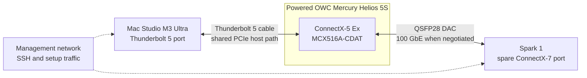
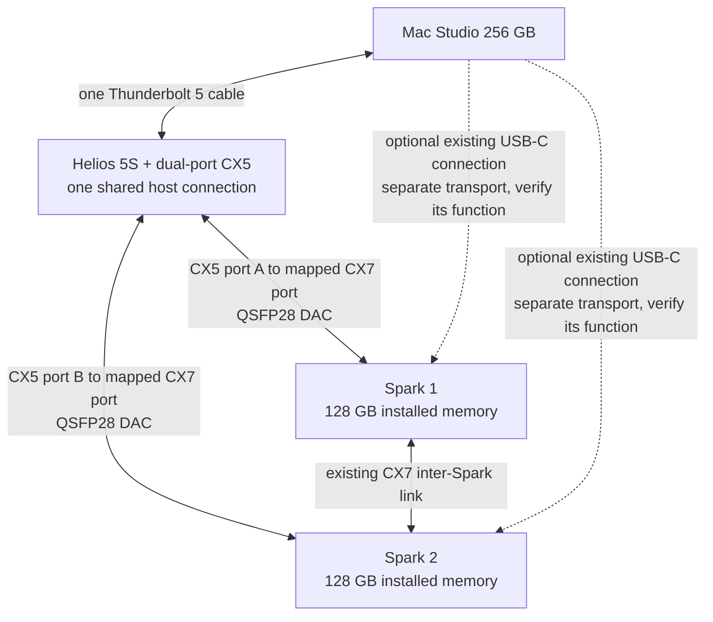
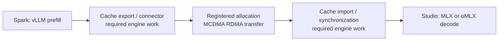

# MCDMA: connect a Mac Studio and NVIDIA Sparks

This guide explains the hardware Ash used, how to connect it, and how to get verified RDMA transfers before adding inference engines. Start with one Spark; add the second once the first passes.

**Reviewed 21 September 2026 against native driver 0.1.18.** This is a development setup, not a plug-and-play production driver. The portable installation procedure has not yet been repeated end to end on a fresh machine. It requires owner-assisted macOS security changes and restarts. Keep the Mac available locally during installation.

## Let your agent help

Give your agent the repository URL and this prompt:

> Set up MCDMA for my Mac Studio and Spark(s) from https://github.com/ashhart/mcdma. Read AGENTS.md, docs/user-guide.md, docs/agent-setup.md and docs/install.md first. Inspect the actual target machines before changing anything. Record a private inventory and work through the checkpoints in order, beginning with one Spark. Prepare everything you can, then guide me through the exact Recovery and approval steps that need me. Verify real READ and WRITE transfers in both directions before reporting success. Set up standalone inference baselines if I choose that stage, but do not claim an engine uses MCDMA without an implemented connector and a verified transfer. Keep a resumable setup record and do not publish my machine details.

An agent with terminal and SSH access can build software, prepare configuration, run tests and report what remains. It cannot perform physical cabling or substitute a chat confirmation for macOS approval. The [agent runbook](agent-setup.md) defines the checkpoints and what evidence to save.

## What you get at each stage

| Stage | Result | What it does not establish |
|---|---|---|
| 1. Hardware and management | The right machines and ports are identified; SSH works | An active RDMA transfer |
| 2. Driver and addressing | MCDMA owns the CX5; each peer has the correct GID and neighbor | Successful payload movement |
| 3. Transfer verification | Byte-checked READ and WRITE, initiated from either machine | Inference speed or arbitrary GPU allocation support |
| 4. Second Spark | Each link works separately, then a bounded concurrent check | Two independent Thunderbolt host links |
| 5. Engine baselines | vLLM on Spark and oMLX on Studio each serve a model | Automatic KV handoff or distributed inference over MCDMA |
| 6. Engine connector | Future integration and its own correctness/performance tests | Something installed by the driver alone |

## 1. Hardware used

| Item | Tested hardware | Quantity for two Sparks |
|---|---|---:|
| Mac | M3 Ultra Mac Studio, 256 GB unified memory | 1 |
| macOS | macOS 27, exact validated build `26A428` | 1 installation |
| PCIe enclosure | OWC Mercury Helios 5S, externally powered | 1 |
| Host cable | Thunderbolt 5 cable between Studio and Helios | 1 |
| Network card | Mellanox ConnectX-5 Ex **MCX516A-CDAT**, PCI ID `15b3:1019`, dual QSFP28 | 1 |
| Linux peers | NVIDIA DGX Spark / GB10 Spark-class machines, each with ConnectX-7 | 2 |
| Studio-to-Spark cables | Mellanox **MCP1600-C001E30N**, 1 m passive copper, QSFP28 to QSFP28 | 2 |
| Management network | Existing Wi-Fi or separate Ethernet with SSH reachability | All hosts |
| Spark-to-Spark cable | Retain the already working CX7 connection and its existing configuration | 1 existing link |

One Spark and one QSFP28 cable are sufficient to start. These are **QSFP28**, not SFP28 connectors. The named DAC was validated at 100GBASE-CR4 with RS-FEC; do not infer a cable's supported speed from its connector alone. This guide does not establish support for other NIC families, enclosures or macOS builds.

The Helios has one host connection for the card. Both CX5 ports share that Thunderbolt PCIe tunnel; two network cables do not create two 100 Gb/s paths into Studio memory. The September 17 tests measured about **50.6 Gbit/s into the Studio** and **29.4 Gbit/s out**, using Studio-initiated READ and WRITE with the conditions in the [validation report](validation-2026-09-17.md). Those are measured payload rates for that setup, not guaranteed rates for yours.

## 2. Plug it in

### First connection



Install the card in the powered-off enclosure following OWC's instructions. For initial driver installation, follow the shutdown/disconnection sequence in [install.md](install.md); do not unplug a live driver while queues or memory mappings exist. Connect the DAC to the Spark's spare CX7 port, preserving its existing inter-Spark connection.

### Full two-Spark layout



“Port A” and “port B” are labels you assign to the physical cables, not assumed OS interface names. Record which card port reaches which Spark port. A previous crossed pair reported active ports but failed transfers; link lights alone are insufficient.

Existing USB-C links can stay connected if they are working, but are not part of this CX5 RDMA setup. Identify their actual interfaces and transport before using them. MCDMA does not automatically combine their bandwidth with the QSFP links. Maintain a known-working management route while changing network configuration.

## 3. Inventory before installation

Save a private copy of [the setup record](examples/setup-record.md) as `local/setup-record.md` in your checkout. Do not paste passwords, SSH private keys or access tokens into it. The repository ignores `local/` and `results/`.

**On the target Studio**, record:

```sh
sw_vers -buildVersion
uname -m
xcode-select -p
xcrun --sdk macosx --show-sdk-version
rdma_ctl status
csrutil status
csrutil authenticated-root status
systemextensionsctl list
```

The native build requires **SDK 27** and the Apple RDMA headers/library. A different macOS build is a compatibility investigation, not permission to remove a version check. If `kmutil` specifically requests a Kernel Debug Kit, obtain the kit matching the running OS build.

**On each Spark**, record:

```sh
uname -m
cat /etc/os-release
nvidia-smi
ip -br link
rdma link
ibv_devices
ibv_devinfo
```

Install missing Linux tools through the [peer preparation section](install.md#4-configure-the-linux-peer-and-restore-the-mac-gid) of the installation guide. Map the spare physical port to its Linux interface and RDMA device; do not assume it is `mlx5_0` or that the relevant GID is at index 1. Record the existing inter-Spark interface so it cannot be mistaken for the Studio link.

Verify key-based SSH to both target hosts over the management network. The cross-host test runner uses SSH even for the Studio endpoint when launched there. Enabling Remote Login or configuring keys is a separate management step; never resolve SSH problems by broadly disabling host-key checking.

## 4. Build and install MCDMA

Use the commands in [the installation guide](install.md) as the single installation recipe. Run Mac commands on the **Studio**, not on a MacBook used to control it. Keep the same checked-out source revision on both endpoints and record `git rev-parse HEAD`.

Work through these checkpoints:

1. **Prepare:** run the source tests and native build; make a separate enabled kext candidate, set the three documented personality flags, sign it and record its UUID and provider hash.
2. **Owner action:** follow Recovery instructions for RDMA enablement and the development kernel-extension policy. The current ad-hoc-signed recipe also disables SIP; authenticated-root protection stays enabled. Read and accept that development tradeoff before changing policy.
3. **Install:** run `tools/install-native.sh --check`, then the documented install command; retain its backup directory.
4. **Approve and restart:** approve MCDMA when macOS requests it, restart, then follow the powered-enclosure connection sequence.
5. **Verify ownership:** compare the loaded build UUID with your candidate, check the provider and enumerate the actual CX5-backed interfaces.

Do not delete Apple's drivers. AppleEthernetMLX5 supplies Ethernet support, while this setup uses the MCDMA native driver and verbs provider for the CX5 RDMA path. `rdma_ctl enable` alone does not install that provider.

**Pass condition:** the intended build owns the card and verbs discovery identifies the CX5-backed device. A version string alone is insufficient because different builds can share a release number.

## 5. Configure the first link

Follow [install.md](install.md) to set Ethernet MTU 9000, select the real RoCE v2 GID and create both static neighbor entries. Begin with RDMA path MTU **4096**, the functional validation recipe; Ethernet MTU and RDMA path MTU are different settings.

For each link, record these values together:

| Studio | Spark |
|---|---|
| Physical CX5 port label | Physical CX7 port label |
| Actual `mcrdmaN` interface and hardware MAC | Linux Ethernet interface and hardware MAC |
| Verbs device name | Verbs device name |
| MAC-derived link-local GID | MAC-derived link-local GID and RoCE v2 index |
| Neighbor pointing to that Spark | Neighbor pointing to that Studio port |

Run `tools/restore-rdma.py --dry-run` with the observed values before applying its configuration. Configure the reciprocal Spark neighbor as described in the installation guide. Variables entered on one host do not appear on another automatically.

MCDMA interfaces supply RDMA addressing, **not ordinary TCP/IP data transport**. Ping, SSH and HTTP over `mcrdmaN` are not acceptance tests. Use the separate management network for those protocols.

**Pass condition:** the checker sees a real GID, both neighbor entries match the physical cable, and the selected devices/ports are active. Rediscover interface names after a restart instead of assuming enumeration stayed the same.

## 6. Prove transfers before measuring speed

Use the exact `tools/native_cross_host.py` invocation in [install.md](install.md), with your recorded SSH destinations, absolute executable paths, interfaces, devices and GID index. This is a small **4 KiB, four-way byte-verifying test**.

| Test arm | `--mac-cq-map` | `--mac-user-post` | `--mac-user-bf` |
|---|---:|---:|---:|
| Kernel posting first | 0 | 0 | 0 |
| Direct userspace posting | 2 | 1 | 0 |
| Userspace BlueFlame-64 | 2 | 1 | 64 |

Use a new output file for each run. Require successful payload verification for Studio WRITE, Studio READ, Spark WRITE and Spark READ, along with the requested mode markers. A successful subprocess or a green port alone is not enough.

Only then measure latency or bandwidth using the [hardware validation guidance](hardware-validation.md), [latency methodology](gpu-keepalive.md) and [bandwidth reproduction commands](validation-2026-09-17.md). Keep raw samples and configuration identity with every result. The historical low-latency table used 0.1.17, path MTU 1024 and an active Metal keepalive; it is not a guaranteed result for 0.1.18 or idle GPUs.

## 7. Add Spark 2

Stop jobs and shut down before changing enclosure cabling. Add the second DAC, discover the second port's identities and repeat addressing and all three correctness arms for Spark 2. Use separate records and result files for each link; do not overwrite Spark 1's neighbor configuration with Spark 2's values.

After both links pass independently, run the documented bounded concurrent tests from the [September 17 report](validation-2026-09-17.md). Preserve the working Spark-to-Spark link and its configuration. The two Studio ports share the enclosure bandwidth, so report aggregate throughput and each link's throughput separately.

For configuration that survives restart, the [CLI guide](../cli/README.md) describes `mcdma configure` and the services it installs. First prove temporary configuration works; inspect the proposed changes before choosing persistence. After restarting, repeat identity discovery and the correctness checks.

## 8. Set up inference engines

### What is available today

| Path | Current position in the reviewed code |
|---|---|
| vLLM on one Spark | Standalone CUDA inference baseline |
| oMLX on Studio | Standalone Metal inference baseline |
| Heterogeneous oMLX branch | Documents a mixed MLX Metal/CUDA pipeline over TCP Ring; not an MCDMA backend |
| vLLM prefill to MLX decode | A measured research handoff exists; its scripts are outside this public repository |
| Installed vLLM-to-oMLX MCDMA connector | Not supplied by this checkout |
| Shared GPU-accessible RDMA buffers | Functional tests passed with Metal shared and CUDA mapped host allocations |
| Existing `cudaMalloc` or Metal private allocations | Not established as a supported direct RDMA path |

Installing two servers does not connect their KV caches. A vLLM Spark process and an oMLX Studio process do not automatically form a distributed model.

### vLLM baseline on a Spark

Use [NVIDIA's Spark vLLM instructions](https://build.nvidia.com/spark/vllm/instructions) and the linked Spark-specific recipes to choose a GB10-compatible image and model. Pin the chosen container digest and model revision in your setup record. Start with a model that fits comfortably on one Spark and a modest context limit; verify Docker GPU access before downloading large weights.

Have your agent prepare the recipe's launch command with these local choices:

- A unique container name such as `mcdma-vllm-baseline`.
- Host port bound to loopback, for example `-p 127.0.0.1:8001:8000`.
- Explicit image digest, model revision, context length and memory budget.
- Persistent model cache, with gated-model credentials supplied locally if required.

Check `http://127.0.0.1:8001/health` and `/v1/models` on the Spark, then send a short chat-completion request to the reported model. Reach it from another machine with an SSH tunnel if needed. Keep the engine on the management network; pointing its HTTP endpoint at `mcrdmaN` will not make it use RDMA.

### oMLX baseline on the Studio

Choose the intended oMLX repository and revision explicitly. Upstream oMLX and a heterogeneous development fork can have different features; an upstream installation must not be presented as installing Ash's experimental cluster work. Follow that revision's installation requirements in an isolated environment.

Once installed and with a compatible small model downloaded into your chosen directory, the reviewed CLI supports:

```sh
omlx serve --model-dir /absolute/path/to/your/models --host 127.0.0.1 --port 8000
```

Check `/v1/models` on port 8000 and complete a short prompt. Record the exact oMLX, MLX and MLX-LM versions, model revision, quantization, context limit and memory settings. Do not replace an existing working engine environment merely to install the driver.

### What must be added for a real handoff

The [first disaggregated experiment](disaggregated-inference.md) used vLLM prefill, a staged KV export over RDMA and MLX decode. Reproducing it requires the missing experiment scripts, compatible weight conversion and a matching cache contract; a stock installation is not enough.



The connector must agree on model weights, tokenizer, token positions, cache layout and dtype; retain buffers and registrations until completion; and synchronize GPU producers/consumers with RDMA. Verify token correctness before measuring time to first token and decode speed. The earlier handoff used MLX directly, not an installed oMLX connector.

### Running a model across all three machines

A 256 GB Studio and two 128 GB Sparks have 512 GB of installed memory in total. They do not become one coherent allocation, and usable capacity is lower after OS, runtime, activations, KV cache and duplicated components.

Pipeline parallelism can place different contiguous layer ranges on each machine and transfer activations at stage boundaries. Every machine owning layers remains involved in both prefill and decode. A proposed 400 GB model needs an actual per-node placement and context-memory budget, not just a comparison with 512 GB installed memory.

Tensor parallelism on the Spark pair is a separate engine/backend setup that may use their existing CX7 link. Bridging that pair to Metal as one pipeline stage requires runtime work; neither vLLM's CUDA tensor parallelism nor a working CX5 driver provides that bridge automatically. The optional USB-C links also need explicit scheduling/transport support before an engine can use them alongside QSFP.

## 9. If something does not work

| Symptom | Next check |
|---|---|
| No native CX5 device | Exact OS/SDK, owner approval, driver ownership, loaded UUID and installed provider |
| `rdma_ctl` enabled but no CX5 RDMA | MCDMA installation and binding; Apple feature enablement is only one prerequisite |
| Port active but transfers time out | Physical cable map, both MAC/GID pairs, reciprocal neighbors, RoCE v2 GID index and MTUs |
| Ping fails on `mcrdmaN` | Expected: use the separate management path |
| Kernel posting passes but userspace fails | Requested mode markers, matching provider/client/build, enabled candidate flags |
| One link works, the other fails | Independent second-link inventory; check for crossed cables or reused neighbor values |
| Link rate is lower than expected | Negotiated rate, cable identity, peer configuration and FEC; do not flash firmware speculatively |
| A restart breaks addressing | Rediscover names by hardware identity and restore both ends |
| API works but no RDMA traffic during inference | Engine integration is missing or not selected; inspect the actual backend |
| Lower throughput with two links | Shared Thunderbolt host path; compare per-link and aggregate measurements |

Use [removal and recovery](install.md#removal-and-recovery) for rollback. Preserve installer backups and restore the kext, provider and configuration as a matching set. Stop applications and shut down before enclosure removal; live mapped hot removal remains unvalidated.

## 10. What to report when asking for help

Share source revision, OS/SDK version, driver version and UUID, provider/client hashes, hardware models, firmware version, negotiated link rate, MTUs, failing stage and sanitized error text. Include whether one or two links were connected and which posting mode failed. Keep raw addresses, SSH destinations, memory-region keys and private paths out of public reports.

## Reference material

- [Canonical installation and rollback commands](install.md)
- [Hardware validation](hardware-validation.md) and [0.1.18 measured bandwidth/lifecycle results](validation-2026-09-17.md)
- [CLI and persistent configuration](../cli/README.md)
- [Experimental vLLM/MLX handoff and limitations](disaggregated-inference.md)
- [OWC Helios 5S specifications](https://www.owc.com/solutions/mercury-helios-5s)
- [NVIDIA Spark vLLM setup](https://build.nvidia.com/spark/vllm/instructions)
- [MLX distributed backends](https://ml-explore.github.io/mlx/build/html/usage/distributed.html)
- [Upstream oMLX](https://github.com/jundot/omlx)

External instructions change; record the actual versions used instead of treating a moving tag or this guide's review date as a compatibility guarantee.
